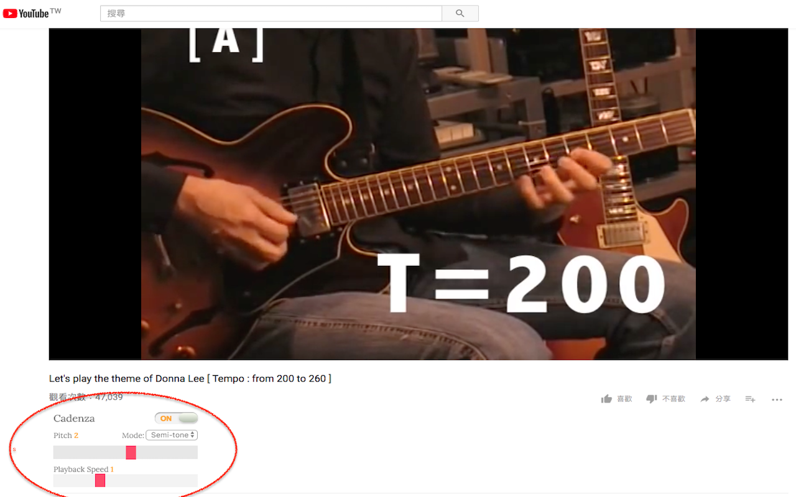

# Cadenza - Youtube Pitch Shifter

> A chrome extension that can shifts the pitch & modified the speed of HTML5 videos. Cadenza is an embedded pitch shifter on youtube.

Download Link: [https://chrome.google.com/webstore/detail/cadenza-youtube-pitch-shi/fcneeeckalcgcklbloocjmhapagkkbfa?hl=zh-TW](https://chrome.google.com/webstore/detail/cadenza-youtube-pitch-shi/fcneeeckalcgcklbloocjmhapagkkbfa?hl=zh-TW)

A chrome extension that shifts the pitch of HTML5 videos. Cadenza is just an *embedded version* of pitch shifter on youtube, based on "Pitch Shifter" by Foxdog Studios. You can download the original extension crafted by Foxdog Studios below.

## Screencast

## Credits

##### Pitch Shifter by Foxdog Studios

A chrome extension that shifts the pitch of HTML5 videos, get it
[here](https://chrome.google.com/webstore/detail/pitch-shifter-html5-video/mpmkclglcbkjchakihfpblainfncennj?hl=en)

Uses the "Jungle" delay pitch-shift from [Chris Wilso's Audio Input Effects](https://github.com/cwilso/Audio-Input-Effects).

Also some of the additional quasi-semi-tone stuff from [mmckegg's soundbank-pitch-shift](https://github.com/mmckegg/soundbank-pitch-shift)

